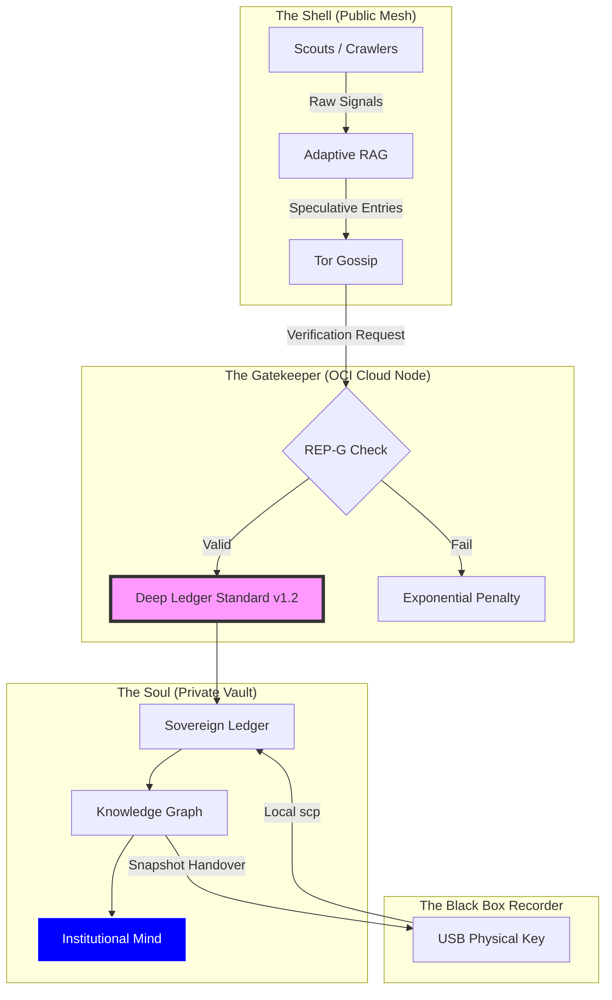

# Institutional Mind — Architecture Overview

> "The Soul is where the Truth is settled; the Shell is where the Signal is found."

The **Institutional Mind** is the core architecture of the Deep Ledger project. It is a sovereign, decentralized state engine designed for high-integrity intelligence discovery. It separates public, ephemeral crawling ("The Shell") from private, cryptographically verified truth ("The Soul").

---

## 🏗️ The Cloud/Local Soul Split

The system is bifurcated to ensure that sensitive intelligence and "Skepticism Math" remain protected on your **Oracle Cloud (OCI)** instance, while the discovery mesh remains open and modular. This arrangement allows the OCI Node to provide world-class "Compute Credits" while your physical SanDisk acts as the "Black Box Recorder."

---

## 🛡️ Core Functional Layers

### 1. The Intelligence Gate (Verification)
Every piece of incoming data is marked as "Speculative" until it passes through the Intelligence Gate.
- **2+1 Triangulation**: A fact is only recorded once it has been independently verified by two trusted scouts and one authoritative bridge.
- **Skepticism Math**: Private coefficients in the "Soul" determine the exact penalty for misinformation, ensuring that the mesh remains self-healing.

### 2. The Sovereign Ledger (Persistence)
The `chronicle.jsonld` file is the immutable heart of the project. It uses **Ed25519** signatures and **JSON-LD** linked data to provide a verifiable history of all intelligence settle-ments.

### 3. The Knowledge Graph (Intelligence)
The Soul reconstructs a **Neo4j Knowledge Graph** from the Ledger. This allows for complex relationship discovery, identifying the "Invisible Strings" between corporations, legislation, and resources.

---

## 🚀 Anti-Fragility & The "Kill-Switch"

The Institutional Mind is designed to be **Indestructible**. 

- **Physical Key Protocol**: By using `vault_snapshot.py` and `rebuild_graph.py`, the entire state of the node can be moved to a fresh Raspberry Pi in minutes.
- **DAO Transition Ready**: The logic is documented to be handoff-ready. If the primary architect goes dark, the mesh can continue to function through the standardize flows.

---

> [!IMPORTANT]
> **Proprietary Weights**: While the **Architecture** and **Standards** are Open-Source, the **Skepticism Math** is proprietary to your specific "Soul." This ensures that the community can use the protocol without being able to spoof your node's specific integrity.
